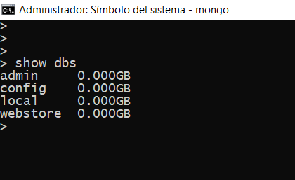

# Comandos de mongo db
***
Este es un pequeño resumen de los coamandos basicos de mongo db

## Indice
* [Listar Bases de Datos](#Listar-Bases-de-Datos)
* [Visualizar la Base de Datos en Uso](#Visualizar-la-Base-de-Datos-en-Uso)
* [Crear Base de Datos](#Crear-Base-de-Datos)
* [Eliminar Base de Datos](#Eliminar-Base-de-Datos)
* [Eliminar Colecion](#Eliminar-Colecion)
* [Otro Comando](#Otro-Comando)


### Listar Bases de Datos
***
```bash
> show dbs
```


**[⬆ Volver al Indice](#indice)**


### Visualizar la Base de Datos en Uso 
***

```bash
> db
```
> Por defecto al iniciar sesion la base de datos es **test**

**[⬆ Volver al Indice](#indice)**

### Crear Base de Datos

```bash
> use database_name
```
**Ejemplo:**
```bash
> use webStore
```

**[⬆ Volver al Indice](#indice)**

### Eliminar Base de Datos
> Para el siguiente comando es necesario
> verificar que la base de datos en uso es la que se desea eliminar esto lo puede hacer con el comando: [db](#db)
<a name="db"><a>
 

```bash
> db.dropDatabase()
```

**[⬆ Volver al Indice](#indice)**

### Crear Coleecion
 

```bash
> db.createCollection("myColeccion")
```
***
**[⬆ Volver al Indice](#indice)**

### Mostrrar Coleciones
 

```bash
> show collection
```
***
**[⬆ Volver al Indice](#indice)**

### Eliminar Colecion
 
```mongodb
> db.collecion.drop()
```
```bash
> db.products.drop()
```
**[⬆ Volver al Indice](#indice)**

### otro comando
 
```mongodb
> db.collecion.drop()
```
```bash
> db.products.drop()
```
**[⬆ Volver al Indice](#indice)**


